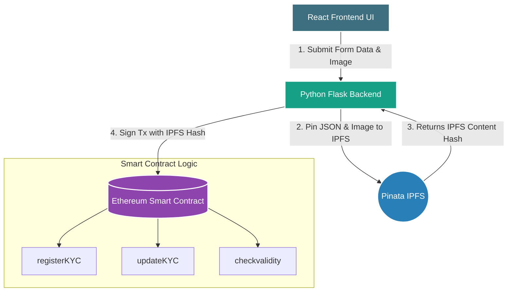

# Know Your Customer (KYC) on Blockchain


*Source: https://www.devteam.space/blog/why-is-blockchain-a-good-solution-for-kyc-verification/*

## Introduction

The objective of this project is to explore the integration of blockchain technology into Anti-Money Laundering (AML) and Know Your Customer (KYC) practices. By using Solidity smart contracts, a Python Flask backend, and a React frontend, we have created a streamlined, web-based utility for secure, cross-institution identity verification.

### The AML/KYC Challenge
**AML (Anti-Money Laundering)** refers to the global legal frameworks designed to prevent criminals from disguising illegal income as legitimate wealth. As global financial transactions have become entirely digitized and increasingly complex, traditional AML procedures are failing to keep pace. The regulatory penalties for non-compliance are severe, driving annual AML compliance costs for North American financial institutions to over **$31.5 billion USD**.

**KYC (Know Your Customer)** is the critical first-step and ongoing identification component of AML. Current centralized KYC processes suffer from severe structural flaws:
1.  **Inefficiency & Customer Friction:** Customers are subjected to repetitive, manual verification processes every time they open a new account with a different institution. There is no shared standard.
2.  **Honeypot Vulnerability:** Centralized databases containing massive amounts of highly sensitive personal data (passports, SSNs, financial histories) are prime targets for large-scale data breaches, leading to mass identity theft.
3.  **Lack of User Autonomy:** Individuals have zero visibility over how their data is shared, stored, or protected once they hand it over to a centralized entity.

## How Can Blockchain Help? 

Blockchain technology provides a paradigm shift from siloed, centralized databases to a **distributed, immutable ledger** shared across a network. It solves the KYC trilemma (security, speed, cost) through several key mechanisms:

*   **The Single Source of Truth:** Instead of 10 banks verifying the same person 10 different times, a user's identity is verified once and permanently anchored to their digital wallet on the blockchain. If Bank A verifies a customer, Bank B can trust that verification by querying the ledger.
*   **Decentralized Data Anchoring:** Storing heavy files (like PDF passports) directly on a blockchain is prohibitively expensive and slow. Blockchain helps by keeping the *heavy data* off-chain (on secure distributed networks like IPFS) while storing a lightweight, mathematically verifiable cryptographic hash (the "pointer") *on-chain*. 
*   **Immutability for Auditors:** Once written to the blockchain, data cannot be tampered with, backdated, or scrubbed. This provides a perfect, unforgeable "Audit Trail" for regulatory investigators tracking criminal networks.
*   **Granular Consent:** Data is natively encrypted and only accessible by third parties when the user explicitly grants permission using their wallet's private keys.

## Project Architecture

The system is organized into three distinct layers, creating a full-stack decentralized application (dApp). This architecture ensures that computational logic and user experience remain fast, while the core records remain incredibly secure.



### 1. Smart Contract Layer (`kyccontract.sol`)
The core trust and logic layer of the system, written in Solidity and deployed to the Ethereum Virtual Machine (EVM).

*   **Data Structure (`Clientdatabase`):** Uses a `Client` struct to map Ethereum wallet addresses (`userID`) to their respective `report_uri` (the IPFS hash linking to their data). It tracks whether a wallet has been `used` (registered) and calculates an `end_date` for expiry.
*   **`registerKYC` Protocol:** This function is the entry point. It receives a new IPFS hash and permanently binds it to the sender's wallet address. It includes a critical `require(!Clientdatabase[userID].used)` check, which serves as a vital AML control by preventing malicious actors from registering multiple dummy identities under a single wallet address.
*   **`updateKYC` Protocol:** KYC data is not static; incomes change, and documents expire. This function allows existing users to override their "current" IPFS pointer with a new one. Crucially, because blockchains preserve historical state, updating a record does not erase the old data. Auditors can still traverse previous blocks to view the history of an identity, preventing criminals from "scrubbing" their past.
*   **`checkvalidity` Protocol:** A read-only deterministic check that compares the current block timestamp against the user's stored `end_date`. In our demonstration environment, reports expire in 5 minutes (for testing), but in production, this enforces an automated annual compliance review (365 days).
*   **`clientLoop` Auditing:** An administrative tool reserved solely for the deploying admin (`msg.sender`). It iterates over the registered user array and flags any identities expiring within 30 days, allowing institutions to preemptively request updated documents.

### 2. Backend API Layer (`KYC_frontend`)
A Python Flask application that provides a RESTful API bridging the end-user and the complex blockchain networking.

*   **File Handling (`app.py`):** Exposes endpoints (`/api/register`, `/api/update`, `/api/checkvalidity`). Unlike simple text applications, this handles `multipart/form-data`, processing both text data and binary image files simultaneously.
*   **IPFS Interoperability (`kyc.py`):** Communicates with the Pinata API. It first pins the user's ID photo to the interplanetary file system, receives the image hash, embeds that hash into a structured JSON manifest containing the user's AML profile, and finally pins that JSON file as well.
*   **Web3 Transactions (`kycreport.py`):** Uses **Web3.py** to construct, sign, and broadcast transactions to the Ganache local blockchain, absorbing the complexity of gas calculation and receipt waiting.

### 3. Frontend Web Interface (`form-react`)
A modern React application built to provide a seamless, Web2-like experience for a Web3 system.

*   **Stateful Tabbed Navigation:** Users can toggle smoothly between registering a new identity, updating an existing one, or checking their status, all without reloading the decentralized application context.
*   **Comprehensive AML Inputs:** Collects essential profiling data explicitly requested by banks: **Nationality, Occupation, and Annual Income**.
*   **Visual Status Indicators:** The validity checker translates blockchain timestamps into intuitive UI cards (Green for Valid, Red for Expired, Orange for Unregistered).

## Launching the KYC System

### Prerequisites
*   **Ganache:** A local blockchain environment.
*   **Pinata Account:** Used for IPFS pinning services.
*   **MetaMask:** For managing Ethereum accounts (Optional for browser connection, but Ganache handles backend deployment).

### Setup Instructions
1.  **Contract Deployment:**
    *   Open `kyccontract.sol` in [Remix IDE](https://remix.ethereum.org/).
    *   Compile the contract.
    *   Deploy using `Custom - External Http Provider` set to your Ganache node (e.g., `http://127.0.0.1:7545`).
    *   Copy the newly deployed **Contract Address**.

2.  **Environment Configuration:**
    *   Inside the `KYC_frontend` directory, open `.env`.
    *   Enter your `PINATA_API_KEY`, `PINATA_SECRET_API_KEY`, and paste the new `KYC_ADDRESS`.

3.  **Boot the Services:**
    *   **Backend:** 
        ```bash
        cd KYC_frontend
        python app.py
        ```
    *   **Frontend:** 
        ```bash
        cd form-react
        npm start
        ```
    *   Open `http://localhost:3000` to interact with the system.

## Handling Money Laundering (AML) Scenarios

This application moves beyond basic identity storage by structurally collecting data designed to catch money laundering typologies:

*   **Profile vs. Activity Mismatch Analytics:** By mandating **Annual Income** and **Occupation** data, institutions can establish a baseline "Source of Wealth." If a "$0 Income Student" wallet receives a $500,000 transaction, the disparity flags immediately in modern Transaction Monitoring Systems (TMS).
*   **Biometric Correlation:** The required ID photo upload, stored immutably on IPFS, ensures human auditors can visually correlate the digitized identity with real-world, government-issued documents, severely crippling "shell account" creation.
*   **Automated Sunset Clauses:** The hardcoded expiry mechanisms ensure that identities cannot lie dormant for years undetected—a common tactic for layering illicit funds.

## Technologies Used

*   **Solidity:** Turing-complete smart contract logic.
*   **React:** Frontend component architecture and state management.
*   **Python/Flask:** Backend API services.
*   **Web3.py:** Ethereum protocol interaction library.
*   **Pinata / IPFS:** Secure, content-addressed decentralized storage.
*   **Ganache:** Local blockchain development network.

## Limitations & Future Scope

1.  **Gas Optimization at Scale:** The `clientLoop` function uses an array iteration (`for` loop) to check for expiring contracts. While fine for a few hundred users, this constitutes an anti-pattern in Solidity as the gas cost grows linearly. Future iterations would move bulk querying off-chain using indexing protocols like **The Graph**.
2.  **AI Verification Integration:** The system currently relies on manual review of the uploaded IPFS images. Future updates could implement decentralized Oracle services (like Chainlink) to pass the image to an AI model for automated facial-recognition mapping against government databases.
3.  **Role-Based Access Control (RBAC):** Implementing an "Admin Dashboard" where centralized regulatory bodies can manually review uploaded IPFS documents and execute a `verifyKYC` transaction, transitioning a user's status from `Pending` to `Verified`.

## Sources

1.  https://risk.lexisnexis.com/insights-resources/research/2019-true-cost-of-aml-compliance-study-for-united-states-and-canada
2.  https://www2.deloitte.com/content/dam/Deloitte/ch/Documents/innovation/ch-en-innovation-deloitte-blockchain-app-in-banking.pdf


 

